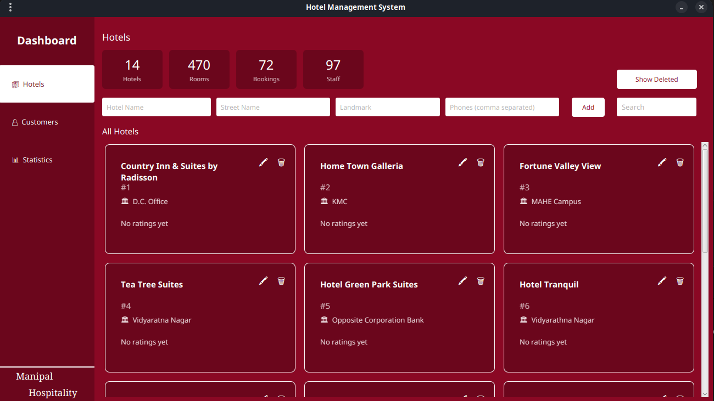

# 🏨 Hotel Management System

## 📌 Overview

A desktop-based Hotel Management System prototype built using **Java and JavaFX** to manage bookings, rooms, staff, and payments across multiple hotels through a centralized interface.

It replaces manual workflows with a structured, database-driven system designed for administrators managing multiple properties.

## Features

### App Users:

- Designed for administrators with support for multiple accounts
- Unique usernames for easy identification
- Uses bcrypt (via jBCrypt) for secure password hashing

### Hotel Management:

- Add, update, and remove hotels
- Centralized system to manage multiple hotels efficiently
- Each hotel has its own workspace for rooms, bookings, staff, and payments

### Room Management:

- Categorize rooms by types
- Displays available room statistics for every hotel
- Addition, updation and decommission of hotel rooms
- Track room availability in real time

### Staff Management:

- Addition, updation and layoff of staff
- Assign roles (Manager, Receptionist, etc.)

### Customer & Booking System:

- Register customer details
- Book rooms for registered customers
- Maintain booking history.
- Ensure room allocation from list of available rooms only

### Payment System:

- Automatic payment record creation upon booking
- Maintain transaction history
- Tracks additonal service charges per booking and mode of payment used
- Records customer ratings

### Statistics:

- Quick overview in dashboard
- Visual representation of:
  - Monthly revenue
  - Booking distribution across hotels

### Data Storage:

- Uses postgreSQL database to store the application data.
- Ensures data integrity using constraints and foreign keys.

## Preview:



## Project Structure

```
├─ Hotel Management System.md
├─ pom.xml
├─ src
   └── main
       ├── java
       │   ├── App.java
       │   ├── behaviors
       │   │   ├── buttonHovering.java
       │   │   └── cardHovering.java
       │   ├── controllers
       │   │   ├── addRoomController.java
       │   │   ├── addStaffController.java
       │   │   ├── billPopupController.java
       │   │   ├── customerController.java
       │   │   ├── dashboardController.java
       │   │   ├── hotelBookingPageController.java
       │   │   ├── hotelPageController.java
       │   │   ├── hotelPaymentsPageController.java
       │   │   ├── hotelRoomsPageController.java
       │   │   ├── hotelStaffPageController.java
       │   │   ├── loginController.java
       │   │   ├── SignUpController.java
       │   │   └── statsController.java
       │   ├── dao
       │   │   ├── bookingDao.java
       │   │   ├── customerDao.java
       │   │   ├── hotelDao.java
       │   │   ├── paymentDao.java
       │   │   ├── roomDao.java
       │   │   ├── staffDao.java
       │   │   ├── statsDao.java
       │   │   └── userDao.java
       │   ├── models
       │   │   ├── BillDetails.java
       │   │   ├── Booking.java
       │   │   ├── Customer.java
       │   │   ├── Hotel.java
       │   │   ├── Payment.java
       │   │   ├── Room.java
       │   │   ├── RoomType.java
       │   │   ├── Staff.java
       │   │   └── StaffRole.java
       │   ├── testConnection.java
       │   └── utils
       │       ├── DBConnection.java
       │       ├── SceneSwitcher.java
       │       └── TableUtils.java
       └── resources
           ├── fxml
           │   ├── addRoom.fxml
           │   ├── addStaff.fxml
           │   ├── billPopup.fxml
           │   ├── customer.fxml
           │   ├── dashboard2.fxml
           │   ├── hotelBookingPage.fxml
           │   ├── hotelPage.fxml
           │   ├── hotelPaymentsPage.fxml
           │   ├── hotelRoomsPage.fxml
           │   ├── hotelStaffPage.fxml
           │   ├── login.fxml
           │   ├── profile.fxml
           │   ├── signup.fxml
           │   └── stats.fxml
           ├── sql
           │   └── init.sql
           ├── static
           │   ├── logo2.png
           │   ├── logo.png
           │   └── qr.png
           └── stats.css
```

## 🛠️ Tech Stack:

- **Language**: Java 21
- **Frontend**: JavaFX
- **Database**: postgreSQL
- **Build Tool**: Maven

## 🚀 Installation:

1. Clone the repository:
```bash
git clone https://github.com/Gulabi-Dil/hotel-management-system.git
```
2. Open the project in your preferred IDE (IntelliJ IDEA/VS Code).
3. Set up the PostgreSQL database:

- Create the database: `createdb -U <username> hoteldb`

- Run the initialization script (ONLY ONCE): `psql -U <username> -d hoteldb -f src/main/resources/sql/init.sql`

- Configure database connection:

  Open src/main/java/utils/DBConnection.java
  Update:
  Database URL
  Username
  Password
  Port (if required)
- Build and run the project: `mvn clean install` followed by `mvn javafx:run`

## Limitations

- Application window cannot be resized.
- Manual re-entry required for reactivating hotels.

## Future Improvements

- Add responsive/resizable UI
- Improve hotel restoration workflow
- Booking multiple rooms at once
- Introduce detailed analytics and reports
- Handle race conditions during simultaneous bookings
- Logout and password reset functionality
